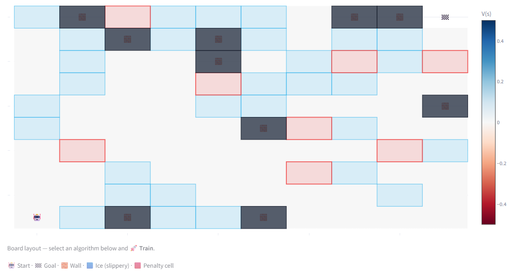
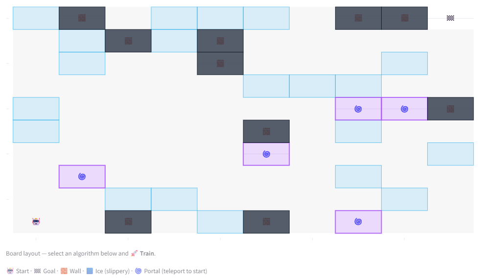
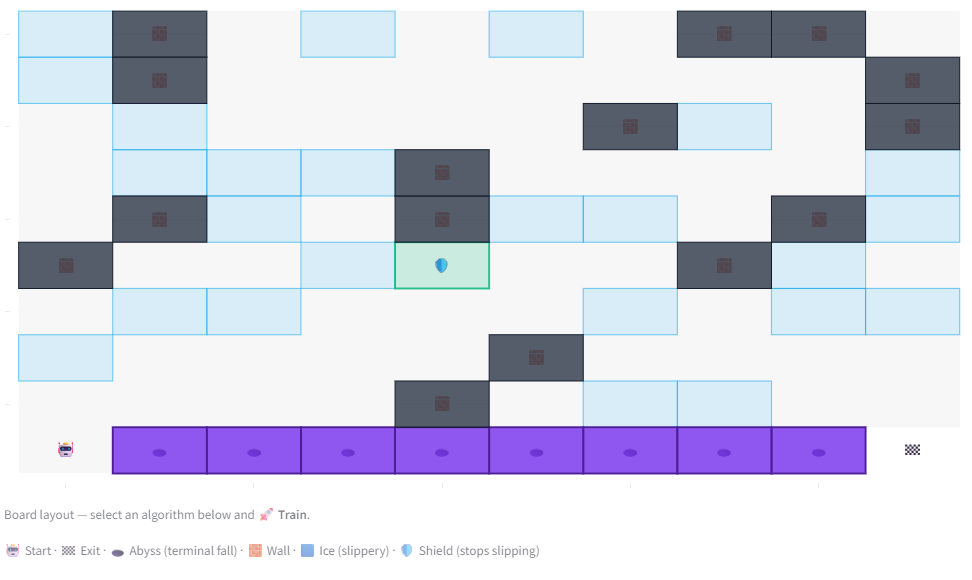
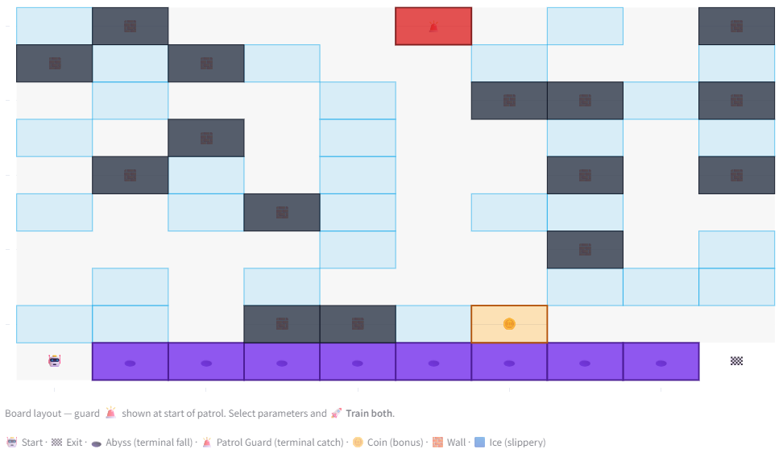
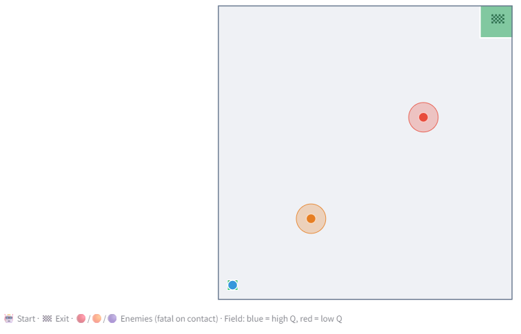
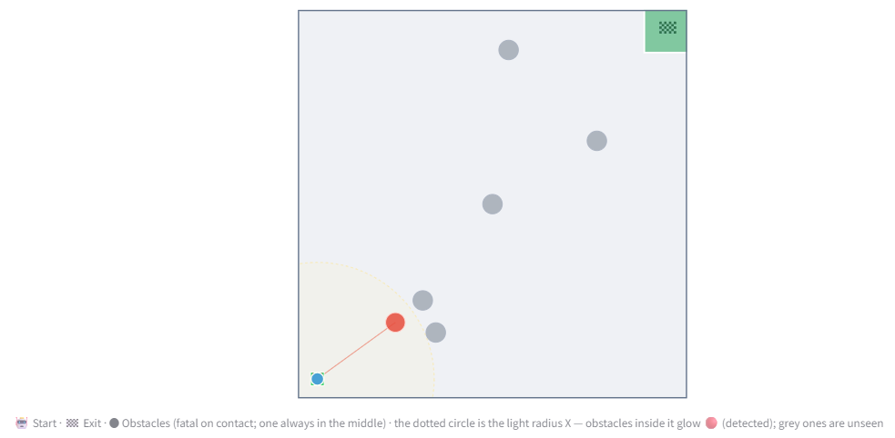

# RL Escape Room

Six escape-room environments, one RL algorithm each — from exact planning to deep
RL under partial observation. Every room shares a **fixed +100 goal reward**;
learning rooms use **−100** for the lethal outcome (fall/catch/collision).

The app ships **uniform defaults** for UI consistency (γ = 0.90, decaying ε
1.0→0.05 decay 0.998, 2000 episodes for the tabular rooms). The **best params**
below are the measured per-room optima — dial them in from the tooltips. Full
sweeps and reasoning live in [docs/TRAINING_PARAMS.md](docs/TRAINING_PARAMS.md).

---

## Room 1 · Dynamic Programming

Icy 10×10 grid with walls, slippery ice, and passable penalty cells. DP uses the
full model to compute the **exact optimal** `V(s)` and policy — hyperparameters
only affect legibility, not correctness.

- **Env default:** 10 walls · 30 ice · slip 0.35 · 8 penalty cells (−6).
- **Best params:** Value Iteration · **γ = 0.95**. (γ makes the value heatmap
  informative; VI is simpler/faster than PI here.)
- **If you change the env:** keep ice ≥ 25 or slip is inert (the path just routes
  around it). High slip + harsh penalties → safe detour wins, still 100% success.

## Room 2 · Monte Carlo

On-policy first-visit MC control. Open board whose signature hazard is **portal
traps** that teleport you back to start. Learns only from sampled episodes;
benchmarked against Room 1's exact V*.

- **Env default:** 10 walls · 20 ice · slip 0.35 · **5 portals**.
- **Best params:** **γ = 0.95**, **3000 episodes**, **decaying ε (decay 0.999)**.
  (γ 0.95 keeps V* / learned / MC-estimate visibly separated — the room's lesson.)
- **If you change the env:** more portals/slip → 5000 episodes + slower decay.
  Never go below ~1000 episodes. Keep penalties mild — MC starves on harsh ones.

## Room 3 · SARSA

On-policy TD on a **cliff-walk**: the bottom row between start and exit is a
terminal −100 abyss. SARSA prices its own exploration risk in and learns a
**cautious detour**. Shields grant slip-immunity (and expand the state).

- **Env default:** 15 walls · 24 ice · slip 0.40 · 1 shield.
- **Best params:** α = 0.10, **γ = 0.95**, 2000 episodes, **constant ε = 0.10**.
  (Decaying-from-1.0 is *fatal* on a terminal cliff — it collapses seeds to
  "flee upward". Low constant ε keeps it near the good path.)
- **If you change the env:** higher slip → drop ε to 0.05 and/or add a shield;
  never use decaying ε here. Bigger detour lesson → ε 0.20–0.30.

## Room 4 · Q-learning (vs SARSA)

Same TD engine, but **SARSA and Q-learning train side-by-side on one board**.
Adds a patrol guard (column 5, terminal) and a **bonus coin** on the ledge.
Off-policy Q-learning greedily takes the coin; SARSA cautiously detours.

- **Env default:** 15 walls · 30 ice · slip 0.30 · coin = 5.
- **Best params:** α = 0.10, **γ = 0.95**, **20000 episodes**, **decaying ε
  (decay 0.9995)**. (Here decaying ε is *required* — constant ε makes SARSA reckless
  too and the contrast collapses. Large state space needs the big episode budget.)
- **If you change the env:** coin ≥ 8 → coin becomes genuinely optimal (contrast
  flips). Keep slip ≤ 0.20 for the crisp SARSA-vs-Q signature.

## Room 5 · Deep Q-Learning

First **continuous** room: an open arena with chasing enemies and direct
(inertia-free) movement. A small MLP approximates Q(s, a). **Double DQN +
reward-scaling** are non-negotiable — vanilla DQN diverges here.

- **Env default:** Chaser + Flanker · enemy speed 0.75× · 60 max steps · random spawns.
- **Best params:** **γ = 0.80**, **lr = 1e-3**, **1500 episodes** → ~98% escape.
  (Low γ beelines to the exit; the dense shaping supplies the immediate signal.)
- **If you change the env:** 3 enemies is the hard wall (~55–64%) — raise to 2000
  episodes and/or lower enemy speed to 0.60. If training diverges, drop lr to 3e-4.

## Room 6 · Advanced DQL — Light & Dynamic Obstacles

Hardest room: **momentum** (friction-damped acceleration) + **partial observation**
— the agent sees only obstacles inside its **light radius**. Layouts re-randomize
every episode, so the headline metric is **Generalisation Score** on held-out
layouts. Same DQN recipe as Room 5.

- **Env default:** light radius 3.0 · 6 obstacles (1 central pillar) · obstacle
  speed 0.5 · friction 0.5 · randomized layout.
- **Best params:** **lr = 3e-4**, **γ = 0.90**, **2000 episodes** (1200 shipped for
  speed) → GEN ~90% static / ~81% moving. (Opposite of Room 5: the larger 1e-3 step
  *hurts* this partially-observed input.)
- **If you change the env:** episodes help more than any other knob. Harder →
  8–10 obstacles. Do **not** raise lr to 1e-3, and keep episodes ≥ 1000.
